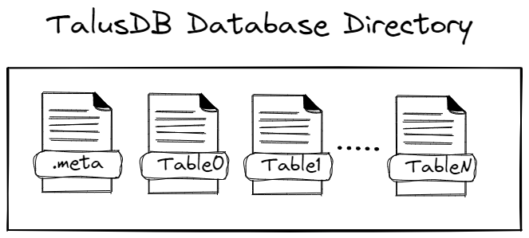
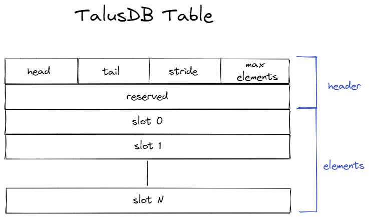

# Wilderness Labs TalusDB Time Series IoT Database

TalusDB is meant to fill a capability gap for far-edge IoT telemetry storage for .NET developers.  Far-edge solutions are often deployed on devices with low performance and low storage capacity.  Network connectivity is often degraded or even denied.  As developers we want to be able to store time-series telemetry data but not have to be concerned with the amount of memory we're consuming or worry about filling the disk if we don't get a network connection for a month.  TalusDB solves this by providing a file-based data storage mechanism designed specifically for edge device store-and-forward applications.

### What TalusDB is 

- TalusDB is fast and uses limited memory
- TalusDB prevents running out of disk space
- TalusDB stores fixed-length telemetry records over time

### What TalusDB is *Not* 

- TalusDB is not a relational database.
- TalusDB is not good at querying or removing data in the middle of a table
- TalusDB is does not store objects or arbitrary-length records

## Basic Architecture

TalusDB has an extremely simple API, consisting of a `Database` that contains `Tables`.  A Database is simply a directory (defaulting to `.talusdb in the application folder`) that contains `Tables`.

The `Table` is the workhorse of the TalusDB engine.  A `Table` is a single file named for the Type of the data it stores. The `Table` file consists of a 16-byte header followed by up to `N` rows of data objects.  The file effectively acts as a Queue with a maximum size set at creation time.  `Insert` adds eleemnts to the file. Elements (records) will get stored until `MaxElements` is reached, at which point the oldest items will get overwritten.  Removing elements is done via a call to `Remove` which will *remove* (i.e. dequeue) a single element from the table.

> **Since Elements are stored in fixed-length slots, TalusDB elements must be fully blittable types**

## "Advanced" Features

TalusDB is not designed to provide loads of features.  Simplicity and low overhead are the core tenets of its architecture.  However there are a few niceties that it does provide to allow applications to handle specific `Table` conditions.

### High Water

Assume you've created a `Table` that can hold up to 100 elements.  There may be cases where your application would like to be aware of when it has reached or exceeded some threshold, let's say 90 records.  The `Table` has both a `HighWaterExceeded` Property and a `HighWater` Event that applications can use to detect this condition.

### Low Water

Similar to High Water, your application may want to be aware of when it has removed enough record to drop below some threshold, let's say 10 records.  The `Table` has both a `LowWaterExceeded` Property and a `LowWater` Event that applications can use to detect this condition.

### Overrun

Since the `Table` has a maximum number of Elements that it may store, when an application does an `Insert()` on a full `Table` the oldest record is lost to an overwrite.  When this happens, an `Overrun` Event occurs.  An application can optionally have the `Table` throw an Exception in this scenario.

### Underrun

Similar to the `Overrun` condition, if an application attempts to `Remove()` an item from an empty `Table` an `Underrun` Event will be raised. An application can optionally have the `Table` throw an Exception in this scenario.

## Coming Features

Since TalusDB is essentially designed as a basic store-and-forward storage mechanism for far-edgte devices, it makes sense to provide some inherent, tested store-and-forward cpabaility.  We will be adding an abstract service and reference implementations for storing telemetry to Azure and AWS cloud storage.

## Contributing

TalusDB, is open source and community powered. We love pull requests, so if you have a feature or fix that fits into the tenets of TalusDB, feel free to submit a PR.  Just make sure that it is

- Documented
- Follows the existing coding standards
- Has some tests
- Has a sample (where appropriate)

## License
Copyright 2023, Wilderness Labs Inc.

> Licensed under the Apache License, Version 2.0 (the "License");
you may not use this file except in compliance with the License.
You may obtain a copy of the License at
>
>  http://www.apache.org/licenses/LICENSE-2.0
>
> Unless required by applicable law or agreed to in writing, software
distributed under the License is distributed on an "AS IS" BASIS,
WITHOUT WARRANTIES OR CONDITIONS OF ANY KIND, either express or implied.
See the License for the specific language governing permissions and
limitations under the License.

## Author Credits
Authors: Chris Tacke